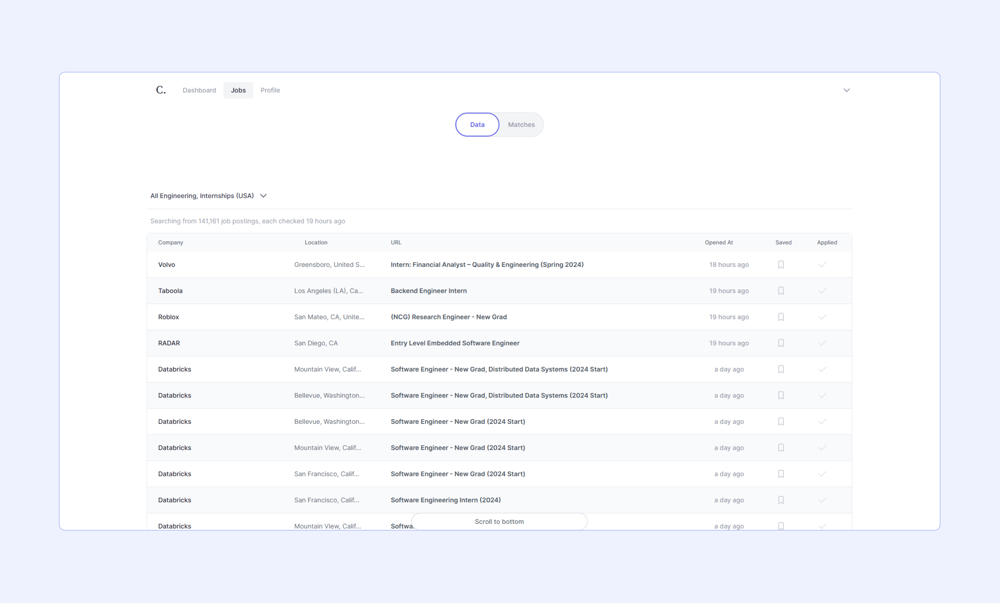

# 2024 Software Engineering New Graduate Positions by Carbos

📅 This board is updated daily using a custom automated job monitor that watches companies vetted for growth, student engagement, & innovation.

💡 This is just 10% of the job data on [Carbos](https://www.carbosjobs.com/?utm_source=github&utm_medium=SWEinternrepo), a platform that connects students with companies that fascinate them (it's all free & only takes 5 minutes to apply!)

‼ In addition to way more companies, Carbos includes custom filters, a stronger pipeline to recruiters, & NEVER sponsors posts on our board (so you only see the roles & companies that best match your interests).

♥ Thanks for all the support, please feel free to leave any [suggestions](https://airtable.com/shr37NBeVqqhlWSq2) (completely anonymous)

---

        

---

| Company | Description | Investors | Title | Status | Added On |
| ------- | ------------| ----------| ----- | ------ |--------- |
| Teledyne | FLIR develops thermal imaging for various applications. Series G funding, $4.5 billion valuation, $1.4 billion raised. | Kleiner Perkins | [SharePoint Junior Nintex Developer](https://flir.wd1.myworkdayjobs.com/flircareers/job/US---Chestnut-Ridge-NY/SharePoint-Junior-Nintex-Developer_REQ19696?utm_source=CarbosJobs) | ❌ | July 21, 2023 |
| Sword Health | Sword Health: Improving musculoskeletal care accessibility. Series B: $60M raised, $360M valuation. | Google Ventures | [Junior ML Engineer (Portugal Based Remote/Hybrid)](https://jobs.lever.co/swordhealth/3a4a2ba1-f398-4c39-8e50-054bd2db5d8e?utm_source=CarbosJobs) | ✅ | July 21, 2023 |
| Squarepoint Capital | SquarePound Capital invests in early-stage fintech companies.$2.1 billion raised, 100+ investments. |  | [Junior Quant Researcher - Data Science](https://www.squarepoint-capital.com?gh_jid=4481896?utm_source=CarbosJobs) | ✅ | July 21, 2023 |
| Squarepoint Capital | SquarePound Capital invests in early-stage fintech companies.$2.1 billion raised, 100+ investments. |  | [Junior Quant Researcher](https://www.squarepoint-capital.com?gh_jid=239376?utm_source=CarbosJobs) | ✅ | July 21, 2023 |
| Old Mission | Old Mission Capital: VC investing in AI/ML startups. Raised $100M from top investors. | Accel, Google Ventures, Kleiner Perkins | [Junior Quantitative Trader (Asian Market Hours)](https://www.oldmissioncapital.com/careers/?gh_jid=4454224003?utm_source=CarbosJobs) | ✅ | July 21, 2023 |
| Old Mission | Old Mission Capital: VC investing in AI/ML startups. Raised $100M from top investors. | Accel, Google Ventures, Kleiner Perkins | [College Graduates - Full-Time - Junior Software Engineer (2024)](https://www.oldmissioncapital.com/careers/?gh_jid=5643831003?utm_source=CarbosJobs) | ✅ | July 21, 2023 |
| Ercot | ERCOT manages Texas electric grid. Raised $2.5 billion in funding. | Goldman Sachs | [Engineer Development Program - Entry Level Power Engineer](https://ercot.wd1.myworkdayjobs.com/en-US/ercot_careers/job/Austin-TX/Engineer-Development-Program---Entry-Level-Power-Engineer_R1376?utm_source=CarbosJobs) | ✅ | July 21, 2023 |
| Applied Intuition | Applied Intuition's mission is to deploy autonomous vehicles for safer roads. The company is in Series D funding with a valuation of $2.3 billion and raised over $200 million. | A16Z, Kleiner Perkins, Sequoia | [Software Engineer - New Grad](https://boards.greenhouse.io/appliedintuition/jobs/4296158005?gh_jid=4296158005?utm_source=CarbosJobs) | ❌ | July 21, 2023 |
| Applied Intuition | Applied Intuition's mission is to deploy autonomous vehicles for safer roads. The company is in Series D funding with a valuation of $2.3 billion and raised over $200 million. | A16Z, Kleiner Perkins, Sequoia | [Product Application Engineer - New Grad](https://boards.greenhouse.io/appliedintuition/jobs/4045211005?gh_jid=4045211005?utm_source=CarbosJobs) | ✅ | July 21, 2023 |
| Rackspace | Rackspace's mission is to enable innovative businesses. Funding: $4 billion raised, $6 billion valuation. | Goldman Sachs, Google Ventures | [Junior Data Scientist](https://jobs.lever.co/rackspace/e6641245-1156-4b4d-945f-fc70ea4b694a?utm_source=CarbosJobs) | ✅ | July 04, 2023 |
| Qualcomm | Qualcomm's mission is to connect the world. Fourth funding round, \$130 billion valuation, \$80 billion raised. |  | [GPU Compiler Developer- Junior (San Diego/Santa Clara/Boxborough/Toronto)](https://qualcomm.wd5.myworkdayjobs.com/External/job/San-Diego-USA/GPU-Compiler-Developer--Junior--SD-SCL-BOX-TOR-_3040062?utm_source=CarbosJobs) | ❌ | July 02, 2023 |
| Pimco | Pimco's mission is to help clients achieve financial goals. Privately held, undisclosed funding and valuation. |  | [Portfolio Manager – Junior Systematic Quantitative Researcher](https://pimco.wd1.myworkdayjobs.com/pimco-careers/job/Newport-Beach-CA-USA/Portfolio-Manager---Junior-Systematic-Quantitative-Researcher_R100959?utm_source=CarbosJobs) | ❌ | July 02, 2023 |
| Applied Intuition | Applied Intuition's mission is to deploy autonomous vehicles for safer roads. The company is in Series D funding with a valuation of $2.3 billion and raised over $200 million. | A16Z, Kleiner Perkins, Sequoia | [Software Engineer - New Grad](https://boards.greenhouse.io/appliedintuition/jobs/4045212005?gh_jid=4045212005?utm_source=CarbosJobs) | ❌ | June 22, 2023 |
| Applied Intuition | Applied Intuition's mission is to deploy autonomous vehicles for safer roads. The company is in Series D funding with a valuation of $2.3 billion and raised over $200 million. | A16Z, Kleiner Perkins, Sequoia | [Junior Software Engineer](https://boards.greenhouse.io/appliedintuition/jobs/4204732005?gh_jid=4204732005?utm_source=CarbosJobs) | ✅ | June 22, 2023 |
| Affirm | Affirm: Making credit accessible and affordable. $1.5B funding, $2B valuation. |  | [Software Engineer, New Grad](https://boards.greenhouse.io/affirm/jobs/5630963003?utm_source=CarbosJobs) | ❌ | June 22, 2023 |
| webfx.com | WebFX helps businesses grow online. Raised $100 million in funding. |  | [Entry Level Software Engineer](https://jobs.lever.co/webfx/7c15f9e7-6ca5-4188-887e-3b147485c58f?utm_source=CarbosJobs) | ✅ | June 21, 2023 |
| Commonwealth Fusion Systems | CFS Energy: Decarbonizing energy with innovative solutions. $1 billion raised from leading investors. |  | [Instrumentation and Control Engineer – Entry Level](https://jobs.lever.co/cfsenergy/bdc3cbaf-7574-411f-8635-b0ea268e7dfc?utm_source=CarbosJobs) | ❌ | June 21, 2023 |
| Binance | Binance: Making crypto accessible. No public funding information. |  | [Binance Accelerator Program - Junior Data Analyst](https://jobs.lever.co/binance/3e2fc921-a871-4cbb-9cd0-8000412053be?utm_source=CarbosJobs) | ❌ | June 21, 2023 |
| Agot | Ago.ai aims to democratize AI. Raised $100 million in funding. | Kleiner Perkins, Sequoia | [Junior Computer Vision Engineer](https://jobs.lever.co/agotai/cf6c3e9d-d5a6-467b-b04f-695af995d46e?utm_source=CarbosJobs) | ✅ | June 21, 2023 |
| Unity Technologies | Unity's mission: Democratize creativity through 3D content creation.Financials: Raised $1 billion, valued at $4 billion. | Accel, Google Ventures, Sequoia | [Junior Test Engineer](https://careers.unity.com/position?id=1742856?gh_jid=1742856?utm_source=CarbosJobs) | ✅ | June 21, 2023 |
| SpaceX | SpaceX aims to make humanity multi-planetary. $850M funding, $74B valuation, $8.5B raised. | Kleiner Perkins | [Security Engineer, New Graduate](https://boards.greenhouse.io/spacex/jobs/6793678002?gh_jid=6793678002?utm_source=CarbosJobs) | ✅ | June 21, 2023 |
| SpaceX | SpaceX aims to make humanity multi-planetary. $850M funding, $74B valuation, $8.5B raised. | Kleiner Perkins | [Security Engineer, New Graduate](https://boards.greenhouse.io/spacex/jobs/6793685002?gh_jid=6793685002?utm_source=CarbosJobs) | ✅ | June 21, 2023 |
| SpaceX | SpaceX aims to make humanity multi-planetary. $850M funding, $74B valuation, $8.5B raised. | Kleiner Perkins | [Security Engineer, New Graduate](https://boards.greenhouse.io/spacex/jobs/6793684002?gh_jid=6793684002?utm_source=CarbosJobs) | ✅ | June 21, 2023 |
